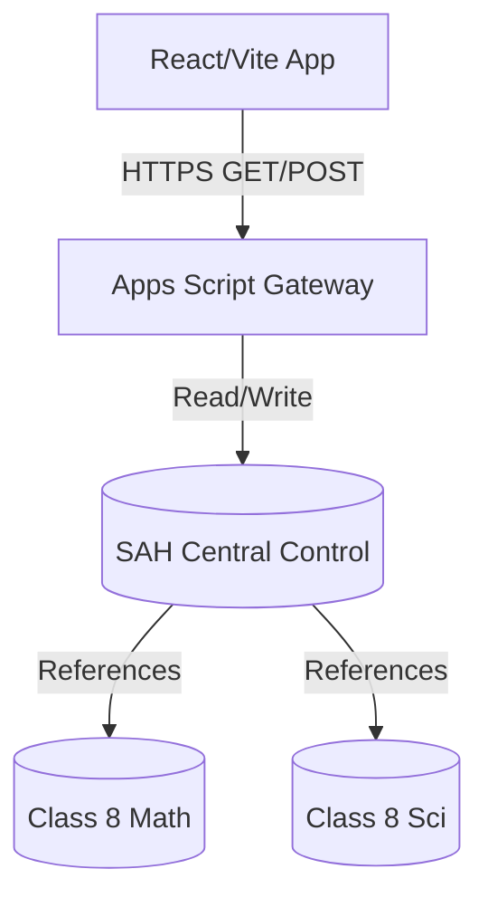

# SAH Command Center — Data Architecture & Google Sheets Schema

This document details the data architecture for the SAH Command Center. It uses a **Google Sheets-backed gateway** architecture, consisting of a single "Central Control" workbook and individual "Class-Subject" workbooks.

## System Architecture

## 1. SAH Central Control Workbook
This is the single source of truth for school administration and routing.

### `app_registry`
Maps logical datasets to actual spreadsheet IDs.
* `dataset_id`: (e.g. `CLASS_8_MATH`)
* `spreadsheet_id`: (The Google Sheets ID)
* `status`: active / inactive

### `teachers`
* `teacher_id`: (e.g. `T001`)
* `teacher_name`: (e.g. `Anjali Bisht`)
* `short_name`: (e.g. `AB`)
* `email`, `phone`, `status`

### `classes`, `sections`, `subjects`
Standard reference tables mapping IDs to display names.

### `section_subject_assignments`
Maps teachers to the sections they teach.
* `assignment_id`, `academic_year`, `class_id`, `section_id`, `subject_id`, `teacher_id`, `role`, `status`

### `timetable_slots`
The master timetable.
* `slot_id`, `academic_year`, `day`, `period_no`, `start_time`, `end_time`, `slot_type`, `class_id`, `section_id`, `subject_id`, `teacher_id`, `room_id`, `status`

### `academic_calendar`
School holidays and exams.
* `event_id`, `academic_year`, `event_type`, `event_name`, `start_date`, `end_date`, `is_working_day`

### `teaching_plan`
The mapped sequence of topics for a class-subject across the year.
* `plan_id`, `academic_year`, `class_id`, `subject_id`, `sequence_no`, `chapter_id`, `topic_id`, `planned_periods`, `status`

### `teaching_progress_summary`
Current state of each section-subject.
* **Composite Key:** `academic_year` + `class_id` + `section_id` + `subject_id`
* `summary_id`, `academic_year`, `class_id`, `section_id`, `subject_id`, `current_chapter_id`, `current_topic_id`, `teacher_id`, `status`

### `topic_progress`
Tracks completion of individual topics for each section.
* **Composite Key:** `academic_year` + `class_id` + `section_id` + `subject_id` + `topic_id`
* `progress_id`, `academic_year`, `class_id`, `section_id`, `subject_id`, `chapter_id`, `topic_id`, `status`, `completed_by_teacher_id`, `completed_on`, `last_updated`

### `period_completion_log` (Write-only)
Appends a row whenever a teacher clicks "Mark Done".
* `log_id`, `academic_year`, `date`, `slot_id`, `class_id`, `section_id`, `subject_id`, `teacher_id`, `chapter_id`, `topic_ids_completed`, `action_type`, `notes`, `timestamp`

---

## 2. Class-Subject Workbook (e.g. SAH_C8_MATH)
Contains the actual curriculum, question bank, and homework mappings for a specific class and subject.

### `Chapter_Map`
* `chapter_id`, `chapter_no`, `chapter_title`, `status`

### `Topic_Map`
* `topic_id`, `chapter_id`, `sequence_no`, `topic_title`, `planned_periods`, `status`

### `Homework_Sets`
* `homework_set_id`, `chapter_id`, `topic_id`, `title`, `source_mode`, `total_questions`, `estimated_minutes`

### `Homework_Items`
* `homework_item_id`, `homework_set_id`, `source_type`, `question_id`, `question_text`, `marks`, `difficulty`, `sequence_no`

### `Questions`
The existing SAH microtests question bank schema (untouched).
* `ID`, `Class`, `Subject`, `Chapter No.`, `Chapter Name`, `Topic`, `Question Type`, `Difficulty`, `Marks`, `Question`, `Option A`, etc.
